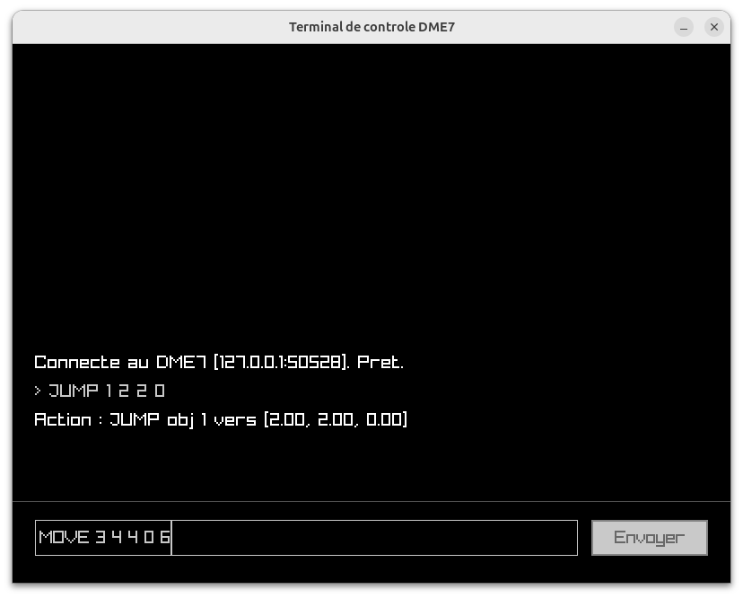

# Guide de l'Utilisateur - YOSC Spatial Controller

Ce document s'adresse aux techniciens son, utilisateur du système immersif Yamaha DME7. Il décrit les procédures d'installation, de lancement et d'utilisation du contrôleur et de son langage dédié.

## 1. Installation

Le déploiement du contrôleur s'effectue via le gestionnaire de paquets natif d'Ubuntu/Debian. Vous n'avez besoin d'aucune compétence en développement pour l'installer.

1. Téléchargez la dernière version du paquet `.deb` (ex: `spatial-controller_1.0.0_amd64.deb`).
2. Ouvrez un terminal dans le dossier de téléchargement et exécutez la commande suivante :

```bash
sudo apt install ./spatial-controller_1.0.0_amd64.deb

```


## 2. Démarrage de l'application

Le programme s'adapte à votre environnement de travail, que vous soyez en phase de préparation (hors-ligne) ou en production.

**Option A : Lancement par défaut (Simulateur local)**
Pour tester l'interface sans matériel physique (sans le processeur Yamaha DME7), vous devez lancer le simulateur fourni avec l'application. Il s'agit d'un programme basique affichant les commandes reçues au format yOSC.

Ouvrez un premier terminal pour démarrer le simulateur :
```bash
dme7-sim
```

Le simulateur restera en attente.

Ouvrez ensuite un second terminal (ou un nouvel onglet) pour lancer l'interface de contrôle :

```bash
spatial-controller
```
L'interface graphique pointera alors automatiquement vers `127.0.0.1` sur le port `50528` (IP et port par défaut du simulateur). Saisissez vos commandes (cf. section 3) : le simulateur affichera en direct toutes les commandes réseau reçues au format yOSC.


**Option B : Lancement ciblé (Exploitation)**
Pour piloter un processeur Yamaha DME7 sur le réseau, renseignez son adresse IP et le port UDP en arguments. 

Exemple :

```bash
spatial-controller 192.168.1.2 50528

```

## 3. Interface et Langage de Commande 

L'interface graphique se compose d'un champ de saisie (en bas) et d'un journal d'exécution (au centre) affichant le retour du parseur syntaxique.



Vous pouvez chaîner plusieurs commandes en les séparant par un point-virgule (`;`). Vous pouvez - on non - terminer chaque instruction par un (`;`)

Voici le dictionnaire des commandes reconnues :

### SET (Mémorisation de coordonnées)

Crée un alias (label) réutilisable pour simplifier les déplacements ultérieurs.

* **Syntaxe :** `SET label coordonnées`
  *(SET en majuscules ; label = caractères alphanumériques sans espace ; coordonnées cartésiennes = 3 nombres entiers ou décimaux)*

**Exemples :**
* `SET center 0 0 0;`
* `SET left -2 1.5 0;`

### JUMP (Déplacement absolu instantané)

Téléporte un objet audio à des coordonnées précises ou vers un label préalablement enregistré.

* **Syntaxe :** `JUMP identifiant_objet destination`
  *(JUMP en majuscules ; identifiant_objet = entier compris entre 1 et 64 ; destination = label ou 3 coordonnées cartésiennes)*

**Exemples :**
* `JUMP 1 2 2 0;`
* `JUMP 2 1.5 0 4.0;`
* `JUMP 3 center;`

### MOVE (Déplacement continu)

Déplace un objet de manière fluide vers une destination sur une durée donnée.

* **Syntaxe :** `MOVE identifiant_objet destination durée`
  *(MOVE en majuscules ; identifiant_objet = entier compris entre 1 et 64 ; destination = label ou 3 coordonnées cartésiennes ; durée = entier représentant les secondes)*

**Exemples :**
* `MOVE 1 left 4;` *(Déplacement vers la gauche en 4 secondes)*

### SWAP (Macro de permutation)

Permute les positions de deux objets de manière fluide sur une durée donnée.

* **Syntaxe :** `SWAP identifiant_objet_1 identifiant_objet_2 durée`
  *(SWAP en majuscules ; identifiants = entiers compris entre 1 et 64 ; durée = entier représentant les secondes)*

**Exemples :**
* `SWAP 1 2 2;` *(Permute les positions des objets 1 et 2 en 2 secondes)*

### PONG (Macro aller-retour)

Déplace un objet depuis sa position actuelle vers une destination, puis le ramène à sa position initiale.

* **Syntaxe :** `PONG identifiant_objet destination durée_trajet`
  *(PONG en majuscules ; identifiant_objet = entier compris entre 1 et 64 ; destination = label ou 3 coordonnées cartésiennes ; durée_trajet = entier représentant les secondes pour un aller)*

**Exemples :**
* `PONG 2 center 2;` *(L'objet 2 va au centre en 2 secondes, puis revient à sa position de départ en 2 secondes)*

### MUTE (Gestion de l'état audio)

Active ou désactive le canal audio d'un objet.

* **Syntaxe :** `MUTE identifiant_objet état`
  *(MUTE en majuscules ; identifiant_objet = entier compris entre 1 et 64 ; état = 0 pour désactiver, 1 pour activer)*

**Exemples :**
* `MUTE 1 0;` *(Désactive le canal audio de l'objet 1)*
* `MUTE 1 1;` *(Réactive le canal audio de l'objet 1)*

### STATUS (Interrogation du processeur)

Interroge le processeur sur la position et l'état actuel d'un objet.

* **Syntaxe :** `STATUS identifiant_objet`
  *(STATUS en majuscules ; identifiant_objet = entier compris entre 1 et 64)*

**Exemples :**
* `STATUS 1;`

### QUIT (Fermeture)

Quitte proprement le programme et coupe les connexions réseau.

* **Syntaxe :** `QUIT`

**Exemples :**
* `QUIT;`
